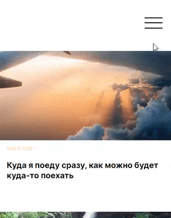
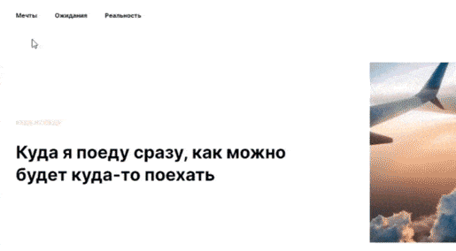
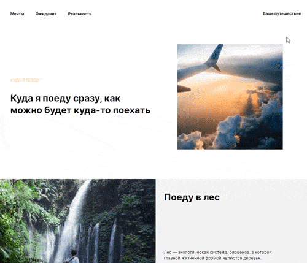

# Where will I go

Project work created within the framework of teamwork at the faculty of ["Web developer"](https://practicum.yandex.ru/web/?utm_source=yandex&utm_medium=cpc&utm_campaign=Yan_Sch_RF_Webr_Razrab_Des_Intro_460&utm_content=sty_search:s_none:cid_56600998:gid_4359516496:pid_23387311960:aid_9838725511:crid_0:rid_:p_1:pty_premium:mty_syn:mkw_:dty_desktop:cgcid_0:rn_Москва:rid_213&utm_term=разработка%20web&yclid=4769457341696616776) of the educational platform [Yandex.Praktikum](https://practicum.yandex.ru/).

*Выбрать язык:* [RU](https://github.com/andrey-71/where-will-i-go/blob/main/README.md)


## Project description:
This project is dedicated to the topic of travel. The goal of the project is to master the skills of teamwork.

**[Project on GitHub Pages](https://andrey-71.github.io/where-will-i-go/index.html)**


## Functional:
* Responsive design at screen resolutions with width from `320px`;
* "Burger menu" on screen resolutions up to `480px`:

  

* All links are working, lead to external resources;
* Links and interactive elements have the hover state: `hover`

  Example of the hover effect in the `header` section:

  

* Popup with form submission

  

## Technologies:

### 1. HTML
* Semantic markup;
* Optimization of images `.jpg`, `.png`, `svg`-graphics.

### 2. CSS
* BEM, Nested BEM;
* Animation;
* Flexbox;
* GridLayout;
* Media queries;
* normalize.css is used to reset browser styles;

### 3. Java Script
* Event handlers `click`, `submit`.


## Installation instructions:
* Clone the repository:

    ```
    git clone https://github.com/andrey-71/where-will-i-go.git
    ```


## Project requirements:
* The width of the elements and the margins differ from the layout by no more than `30px` at the control point `1280px`;
* The markup does not break and there are no horizontal scrolls on the interval from `320px` to infinity;
* All sections specified in the layout are present;
* A BEM file structure has been created (Nested);
* The text does not go beyond the border of its block;
* The code is formatted the same way, the indentation hierarchy is observed;
* Selectors by tag are not used;
* No nesting of more than two selectors;
* Content images have alt with the correct description corresponding to the language of the page;
* `! important`is not used;
* The `Inter` font is used. Font size, font style and color, as in the layout;
* For each font, alternative variants from the system fonts are specified. Extra fonts are not connected, there are no extra fonts in the `fonts` folder;
* No text block has a fixed height set;
* Absolute positioning is not used anywhere except in places that cannot be implemented by static or relative positioning.
