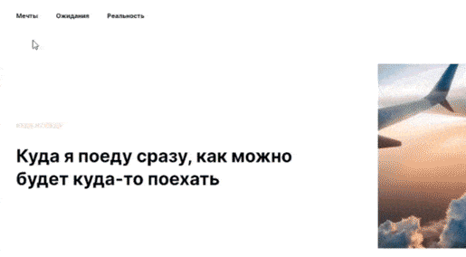

# Куда я поеду?

Проектная работа, созданная в рамках командной разработки на факультете ["Веб-разработчик"](https://practicum.yandex.ru/web/?utm_source=yandex&utm_medium=cpc&utm_campaign=Yan_Sch_RF_Webr_Razrab_Des_Intro_460&utm_content=sty_search:s_none:cid_56600998:gid_4359516496:pid_23387311960:aid_9838725511:crid_0:rid_:p_1:pty_premium:mty_syn:mkw_:dty_desktop:cgcid_0:rn_Москва:rid_213&utm_term=разработка%20web&yclid=4769457341696616776) образовательной платформы [Яндекс.Практикум](https://practicum.yandex.ru/).

*Select a languages:* [EN](https://github.com/andrey-71/where-will-i-go/blob/main/README.en.md)


## Описание проекта:
Данный проект посвящен теме путешествий. Целью проекта является освоение навыков командной разработки.

**[Проект на GitHub Pages](https://andrey-71.github.io/where-will-i-go/index.html)**


## Функционал:
* Адаптивный дизайн на разрешениях экрана шириной от `320px`;
* "Бургер-меню" на разрешениях экрана шириной до `480px`:

  

* Реализована навигация на странице через внутренние ссылки;
* Ссылки и интерактивные элементы имеют состояние наведения `:hover`

  Пример эффекта наведения в секции `header`:

  

* Popup с отправкой формы

  

## Технологии:

### 1. HTML
* Семантическая верстка;
* Оптимизация изображений `.jpg`, `.png`, `svg`-графики.

### 2. CSS
* БЭМ, Nested БЭМ;
* Анимация;
* Flexbox;
* GridLayout;
* Media queries;
* Применяется normalize.css для обнуления стилей браузера.

### 3. Java Script
* Обработчики событий `click`, `submit`.


## Инструкция по установке:
* Клонировать репозиторий:

    ```
    git clone https://github.com/andrey-71/where-will-i-go.git
    ```


## Требования к проекту:
* Ширина элементов и отступы отличаются от макета не более, чем на `30px` на контрольной точке `1280px`;
* Вёрстка не ломается и нет горизонтальных скроллов на промежутке от `320px` до бесконечности;
* Присутствуют все секции, указанные в макете;
* Создана файловая структура по БЭМ (Nested);
* Текст не выходит за границу своего блока;
* Код форматирован одинаково, соблюдается иерархия отступов;
* Не используются селекторы по тегу;
* Нет вложенности более двух селекторов;
* Контентные изображения имеют alt с корректным описанием, соответствующим языку страницы;
* Не используется `!important`;
* Используется шрифт `Inter`. Размеры, начертания и цвет шрифта, как в макете;
* Для каждого шрифта указаны альтернативные варианты из системных шрифтов. Не подключены лишние шрифты, в папке `fonts` не лежат лишние шрифты;
* Ни одному текстовому блоку не задана фиксированная высота;
* Абсолютное позиционирование не используется нигде, кроме мест, которые нельзя реализовать статичным или относительным позиционированием.
